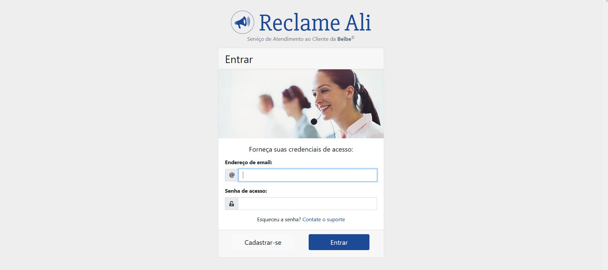
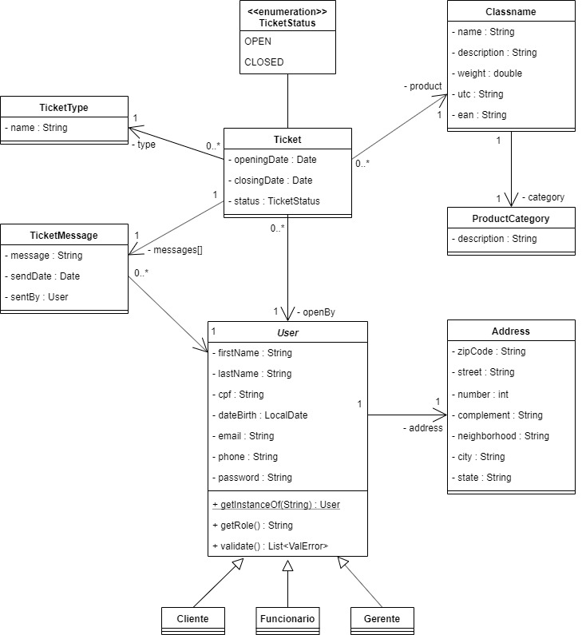
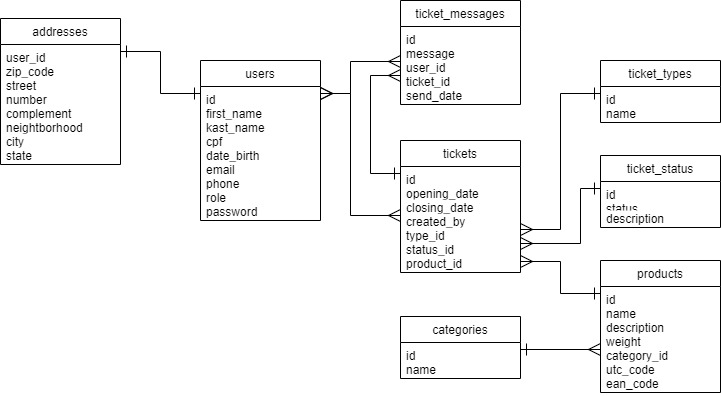
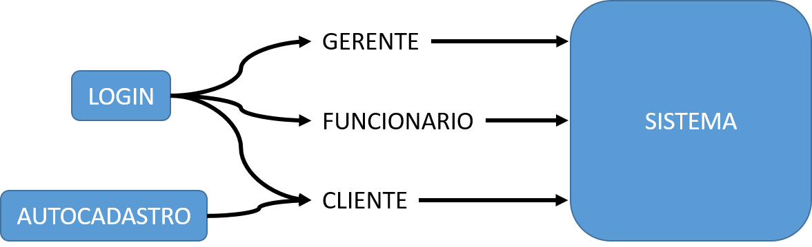
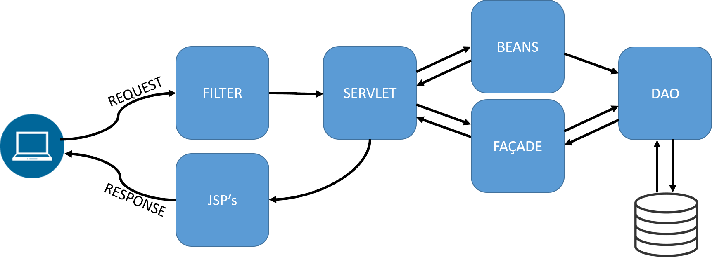

# ReclameAli - Customer Service System

- **Develepoled by:**
  - [Julio L. Muller](https://juliolmuller.github.io/)
  - [Cassiano Kruchelski V.](https://github.com/kruchelski)
  - [André K. Antunes](https://github.com/andrekantunes)
  - [Wesley Caetano C.](https://github.com/vvesleyc)
  - [Aurélio S. Matsunaga](https://github.com/aureliomatsunaga)
- **Released on:** Nov 28, 2019
- **Last Updated on:** Dec 7, 2019
- **Latest version:** 1.0.4
- **License:** MIT

## Overview

This application was developed using pure Java EE specifications, in other words, with **no framework**, but with pure servlets and JSP usage, although many libraries were allowed to be used as well, like JSTL, Gson (for converting objects into JSON) and Jasper (for reports generation).

This project was developed as a college assignment for the subject _Web Development II_, following the specifications detailed in [this document (in portuguese)](./docs/Assignment%20Statement%20-%20Project%20Specifications.pdf).

[Check out the application running](https://reclamejava.herokuapp.com/)

## Archtecture and Features

The application was structured trying to follow the MVC pattern. Servlets and façades work like _controllers_, JSPs like the _view_ layer and the remaining classes hold the business logics, like DAOs, beans and other services.

The main business classes are designed like this:

Following the assignment statement, the application should have 3 different access roles:

- _cliente_ (customer);
- _funcionario_ (attendant); and
- _gerente_ (manager).

...easch one of these profiles should have their own features and permissions. For these reason, this is a key property to access and navigate thoughout the system. So we stablished the attribute **role** as a key factor to know which user is navigating and which resources it is allowed to access. This info is stored in the database along with the user record.

Although the **role** attribute is persisted in the database, this is not an information used by the application directly, like other attributes do. Instead, it is used to instantiate the appropriate subclass of _User_. So everytime a record of user is selected from database, it instantiate its respective class. The same applies to the user navigating though the system.

Then, the router controls the permission to access the resources by evaluating the instance of _User_ stored in sesstion scope.

Also, as displayed in the image above, the customer is the only user capable of registering himself to the platform. Attendants and managers must be included by others managers - easy to understand why, but it is part of the project specifications.

Once a user is logged in, all the requests flow though _filters_, so no user access forbidden areas/resources.

### Routes

As a Java EE application feature, the server maps the routes requested by the client and assigned the appropriate resource to that request. Thus, these are the URLs available in the application:

#### Public Routes:

| URL                 | Method |  Parameters   | Action                                                           |
| ------------------- | :----: | :-----------: | ---------------------------------------------------------------- |
| `/` or `/index.jsp` |  GET   |       -       | Redirects to `/entrar`.                                          |
| `/entrar`           |  GET   |       -       | Displays access screen.                                          |
| `/entrar`           |  POST  | action=signin | Processes user credentials submitted though signin form.         |
| `/entrar`           |  POST  | action=signup | Processes customer data submitted though self-registration form. |
| `/sair`             |  GET   |       -       | Destroys existing sessions and redirects to `/entrar`.           |

#### Customer Routes:

As rule, all the resources available to customers (_cliente_ role) are accessable thought URL `/cliente/*`, except for the APIs consumed by the application in background.

| URL                                | Method |   Parameters   | Action                                                 |
| ---------------------------------- | :----: | :------------: | ------------------------------------------------------ |
| `/` or `/index.jsp`                |  GET   |       -        | If customer is authenticated, redirects to `/cliente`. |
| `/cliente`                         |  GET   |       -        | Displays customer's homepage.                          |
| `/cliente/atendimentos`            |  GET   |       -        | Displays all customer's tickets.                       |
| `/cliente/atendimentos/novo`       |  GET   |       -        | Displays the form to submit new tickets.               |
| `/cliente/atendimentos/novo`       |  POST  |       -        | Processes the data from new tickets form.              |
| `/cliente/atendimentos/acompanhar` |  GET   |      id=#      | Displays the details for the ticket '#'.               |
| `/api/tickets`                     |  POST  | action=message | Processes new messages added to the ticket.            |

#### Attendant Routes:

The same way, the routes tend to be prefixed with `/funcionario`:

| URL                                    | Method |   Parameters   | Action                                                      |
| -------------------------------------- | :----: | :------------: | ----------------------------------------------------------- |
| `/` or `/index.jsp`                    |  GET   |       -        | If attendant is authenticated, redirects to `/funcionario`. |
| `/funcionario`                         |  GET   |       -        | Displays attendant's homepage and dashboard.                |
| `/funcionario/atendimentos`            |  GET   |       -        | Displays the list of all tickets.                           |
| `/funcionario/atendimentos/acompanhar` |  GET   |      id=#      | Displays the details for the ticket '#'.                    |
| `/funcionario/atendimentos/acompanhar` |  POST  |      id=#      | Requests the ticket '#' to be switched to 'closed'.         |
| `/api/tickets`                         |  POST  | action=message | Processes new messages added to the ticket.                 |
| `/funcionario/categorias`              |  GET   |       -        | Displays the list of existing categories.                   |
| `/api/categories`                      |  GET   |       -        | Returns the list of all categories as JSON.                 |
| `/api/categories`                      |  GET   |      id=#      | Returns the category with ID '#' as JSON.                   |
| `/api/categories`                      |  POST  |   action=new   | Processes the data sent through new category form.          |
| `/api/categories`                      |  POST  | action=update  | Processes the data to update the selected category.         |
| `/api/categories`                      |  POST  | action=delete  | Deletes the selected category.                              |
| `/funcionario/produtos`                |  GET   |       -        | Displays the list of existing products.                     |
| `/api/products`                        |  GET   |       -        | Returns the list of all products as JSON.                   |
| `/api/products`                        |  GET   |      id=#      | Returns the product with ID '#' as JSON.                    |
| `/api/products`                        |  POST  |   action=new   | Processes the data sent through new product form.           |
| `/api/products`                        |  POST  | action=update  | Processes the data to update the selected product.          |
| `/api/products`                        |  POST  | action=delete  | Deletes the selected product.                               |

#### Manager Routes:

Managers also should navigate under the prefix `/gerente`:

| URL                                | Method |   Parameters    | Action                                                |
| ---------------------------------- | :----: | :-------------: | ----------------------------------------------------- |
| `/` or `/index.jsp`                |  GET   |        -        | If manager is authenticated, redirects to `/gerente`. |
| `/gerente`                         |  GET   |        -        | Displays manager's homepage and dashboard.            |
| `/gerente/atendimentos`            |  GET   |        -        | Displays the list of all tickets.                     |
| `/gerente/atendimentos/acompanhar` |  GET   |      id=#       | Displays the details for the ticket '#'.              |
| `/gerente/atendimentos/acompanhar` |  POST  |      id=#       | Requests the ticket '#' to be switched to 'closed'.   |
| `/api/tickets`                     |  POST  | action=message  | Processes new messages added to the ticket.           |
| `/gerente/colaboradores`           |  GET   |        -        | Displays the list of managers and attendants.         |
| `/api/users`                       |  GET   |        -        | Returns the list of all users as JSON.                |
| `/api/users`                       |  GET   |      id=#       | Returns the user with ID '#' as JSON.                 |
| `/api/users`                       |  POST  |   action=new    | Processes the data sent through new user form.        |
| `/api/users`                       |  POST  |  action=update  | Processes the data to update the selected user.       |
| `/api/users`                       |  POST  | action=password | Updates the selected user's password.                 |
| `/api/users`                       |  POST  |  action=delete  | Deletes the selected user.                            |

### Data Validation

All model classes (which have equivalent tables within database and have insersions and updates) have the implementation of method `validate()`, which can be called by the controller **before** saving changes into database. This method is responsible - as you may imagine - for validating all the attributes set to that object. It will always return an instance of _ArrayList&lt;ValError&gt;_, which is a list of errors messages that may be wrapped as a bean and sent to a JSP or as JSON. An empty ArrayList means no validation errors.

## Technologies

Here are the main technologies used to build this project:

### Back-End

- Programing Language: [Java 8](https://www.oracle.com/technetwork/java/javase/overview/java8-2100321.html)
- Server (Java EE implementation): [GlassFish 4](https://javaee.github.io/glassfish)
- Tags library: [JSTL 1.2](https://www.oracle.com/technetwork/java/index.html)
- JSON library: [Google Gson 2.8](https://github.com/google/gson)
- Reports Compiler: [Jasper Reports 6.10](https://community.jaspersoft.com/project/jasperreports-library)
- Relational Database: [PostgreSQL 11](https://www.postgresql.org/)

### Front-End

- JavaScript libraries:
  - [jQuery 3.4](https://jquery.com/)
  - [DatePicker plugin](https://fengyuanchen.github.io/datepicker/)
  - [Mask plugin](https://igorescobar.github.io/jQuery-Mask-Plugin/)
  - [Toastr 2.1](https://github.com/CodeSeven/toastr/)
- Styles: [Bootstrap 4](https://getbootstrap.com/)

### Dev Tools

- Integrated Development Enviroment: [NetBeans 8.2](https://netbeans.org/)
- Text Editor: [Visual Studio Code](https://code.visualstudio.com/)
- Versioning Tool: [Git](https://git-scm.com/)
- Remote Repository: [GitHub](https://github.com/)
- Console Emulator: [Cmder](https://cmder.net/)
